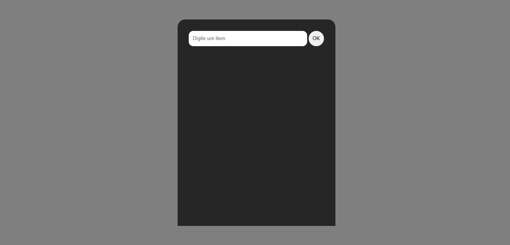

# Crie Sua Lista

Este projeto permite criar uma lista de itens de forma interativa. Adicione itens digitando-os e clicando no botão, e remova-os clicando no "❌".

## Funcionalidades

*   **Adicionar itens:** Digite o texto do item no campo de texto e clique no botão para adicioná-lo à lista.
*   **Remover itens:** Clique no "❌" ao lado de um item na lista para removê-lo.
*   **Validação de entrada:** Um alerta é exibido se você tentar adicionar um item vazio.
*   **Design responsivo:** A interface se adapta a diferentes tamanhos de tela, especialmente dispositivos móveis.

## Tecnologias Utilizadas

*   **HTML:** Estrutura do conteúdo e elementos da página.
*   **CSS:** Estilização da página, incluindo cores, layout e responsividade.
*   **JavaScript:** Interatividade, como adicionar e remover itens da lista, e validação de entrada.

## Como Usar

1.  Clone este repositório.
2.  Abra o arquivo `index.html` em seu navegador.
3.  Digite o nome do item no campo de texto.
4.  Clique no botão para adicionar o item à lista.
5.  Clique no "❌" ao lado do item para removê-lo.
